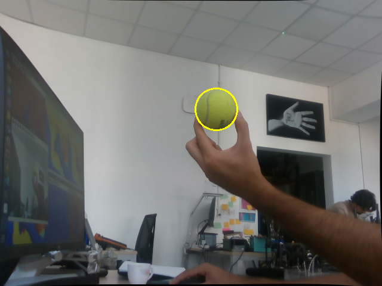
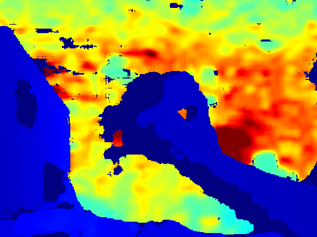
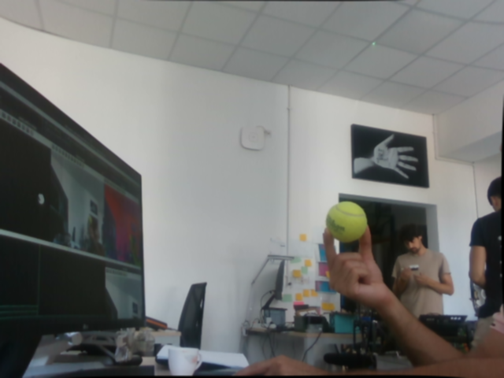
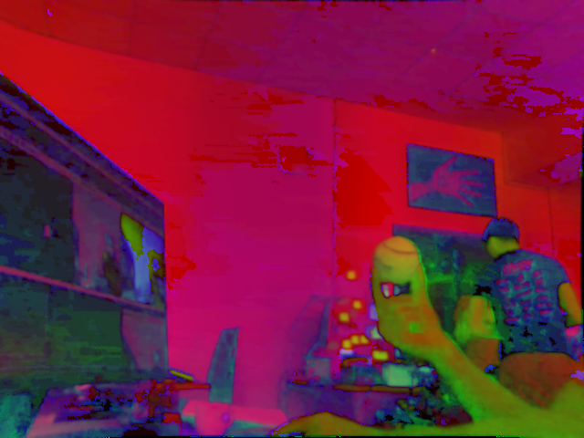
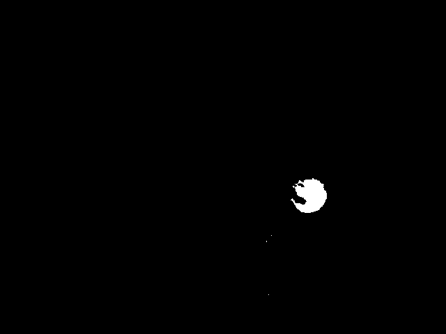
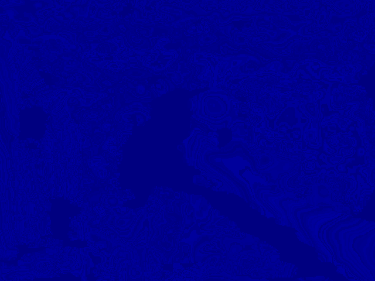
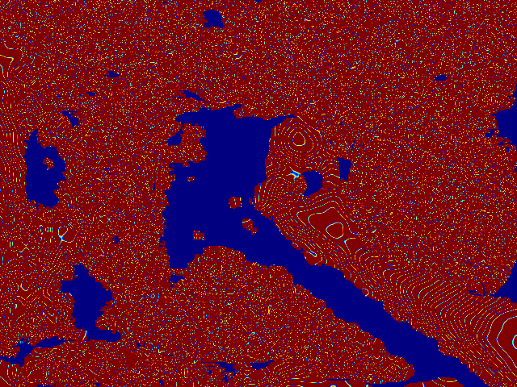
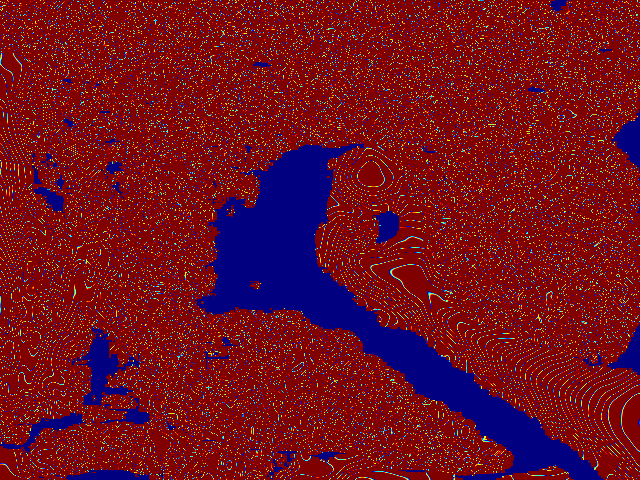
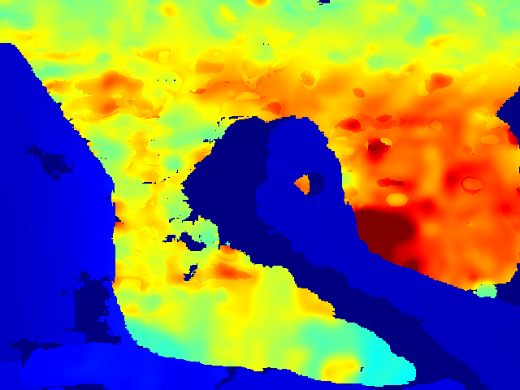
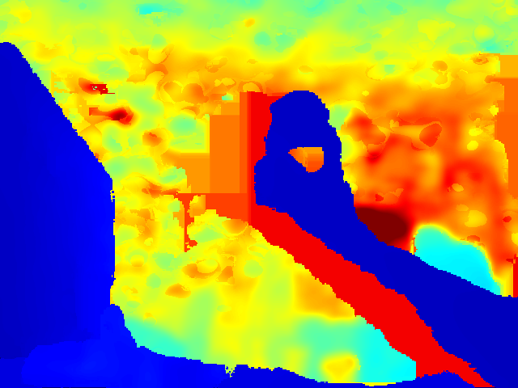

# Ball Detection, Pose and Velocity Detection

The ball is detected through the rgbd camera and Depth and Color streams are generated. 
the raw generated data are converted to the numpy arrays and they are shown as follows through the opencv library:

<table>
  <tr>
    <td></td>
    <td></td>
  </tr>
</table>

The following processings are done on the RGB image:
<table>
  <tr>
    <td></td>
    <td></td>
    <td></td>
  </tr>
</table>

and the following filters are applied to the Depth Images to have a noiseless information of the position of the ball in 3D Environments.
<table>
  <tr>
    <td></td>
    <td></td>
    <td></td>
  </tr>
  <tr>
    <td></td>
    <td></td>
  </tr>
</table>

the positions can be detected correctly in $mm$ in 3D.

thereafter, a kalman filter is applied to estimated the postion of the ball while there are no information from the camera that could be fed into the network. so during those periods, the data from kalman filter will be fed to the network and once some data are derived from camera, the Kalman Filter Will be updated.
