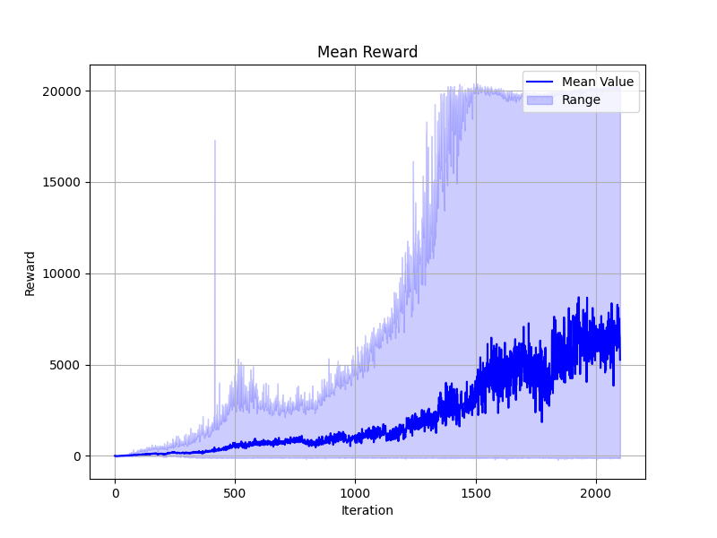

# Ball Detection, Pose and Velocity Detection

The ball is detected through the RGBD camera, and depth and color streams are generated. The raw generated data are converted to numpy arrays and are shown as follows through the OpenCV library:

<table>
  <tr>
    <td></td>
    <td></td>
  </tr>
</table>

The following processes are performed on the RGB image:

<table>
  <tr>
    <td>
      

        
        

          Blurred Image
        

      

    </td>
    <td>
      

        
        

          HSV Image
        

      

    </td>
    <td>
      

        
        

          Mask Yellow Image
        

      

    </td>
  </tr>
</table>

The following filters are applied to the depth images to obtain noiseless information about the position of the ball in 3D environments.
<table>
  <tr>
    <td>
      

        
        

          Disparity Image
        

      

    </td>
    <td>
      

        
        

          Spatial Filtered Image
        

      

    </td>
    <td>
      

        
        

          Temporal Filtered Image
        

      

    </td>
  </tr>

  <tr>
    <td>
      

        
        

         Depth Filtered Image
        

      

    </td>
    <td>
      

        
        

         Hole Filled Image
        

      

    </td>
  </tr>
  
</table>

### Depth to Disparity Transformation:
Disparity data shows the horizontal shift between each point in a camera and the corresponding one in the other one
* It converts the depth data into disparity data.
### Disparity to Depth Transform
* It converts back the disparity data into depth data.
### Spatial Filter
* It reduces the noise of the depth data by smoothing the area while conserving the edges of the data
### Temporal Filter
* It reduces the temporal noise by filtering depth frame over time and getting the average depth data over time.
### Hole Filling Filter
* It fills the gaps in the depth data by interpolation the data at those gaps

The positions can be detected correctly in millimeters ($mm$) in 3D.

Thereafter, a Kalman filter is applied to estimate the position of the ball when there is no information from the camera that could be fed into the network. During these periods, the data from the Kalman filter will be fed to the network, and once some data are derived from the camera, the Kalman filter will be updated.

# RL Algorithm
<table>
  <tr>
    <td></td>
  </tr>
</table>

As illustrated in the figure, each individual agent collects data from its environment, and the collected data from all the environments is gathered in a buffer called a trajectory. Then the trajectory is split into mini-batches, which can be determined by the user.

Thereafter, each mini-batch is fed to the networks sequentially, and for each mini-batch, the networks are updated a number of times as defined by the *number of training epochs*. 

Moreover, the following parameters are randomized during training and the randomizitation is done at the beginning of each iteration:

- Static and Dynamic friction as well as the restitution of the Manipulator links and the Ball
- Stiffness and Damping of the joint actuators
- Lower and Upper Limits of joint positions
- Mass of the Ball
- Added noise to the observation space
- Initial position and velocity of the Ball
- Initial Joint Angles

  

<table>
  <tr>
    <td></td>
    <td></td>
  </tr>
</table>

In addition to the randomized parameters, the hyperparameters of the reinforcement learning model are changing dynamically at specific iterations. In the following figure, the schedule of two hyperparameters, *Clip parameter* and *Entropy coefficient*, is represented:

<table>
  <tr>
    <td></td>
  </tr>
</table>

## reward function

In the following functions, $e$ means end effector and $b$ means ball.

the Reward function is as follows:

### Distance reward

<table>
  <tr>
    <td>
      $$d = \|p_e - p_b\|_2$$
      $$r_d = \frac{1}{1 + d^2}$$
    </td>
    <td></td>
  </tr>
</table>

The distance reward is calculated as:

$$d = \|p_e - p_b\|_2$$

$$r_d = \frac{1}{1 + d^2}$$

where $p_e$ is the end effector position and $p_b$ is the tennis ball position.

## Orientation Reward
The orientation reward is:

$$r_o = -\text{clamp}(\hat{z}_e \cdot \hat{v}_b, -1, 1)$$

where $z_e$ is the normalized end effector z-axis and $\hat{v_b}$ is the normalized tennis ball velocity.

## Relative Velocity Reward
$$r_v = \frac{1}{1 + \|v_e - v_b\|_2^2}$$

$$r_{rv} = r_d \cdot r_v$$

where $v_e$ is the end effector velocity and $v_b$ is the tennis ball velocity.

## End Effector Velocity Penalty
$$p_v = \|v_e\|_2$$

## Smoothness Penalties
$$s_l = \|a_e\|_2$$

$$s_a = \|\alpha_e\|_2$$

where $a_e$ is the end effector linear acceleration and $\alpha_e$ is the angular acceleration.

## Task-specific Rewards
For different tasks (moving to target, stabilized ball, centralized ball, caught ball), the rewards are scaled differently:

1. Moving to target:
   - $r_t = 1.0$
   - $r_d' = 1.8 \cdot r_d$
   - $r_{rv}' = 1.8 \cdot r_{rv}$
   - $r_s = 1.6$
   - $r_g = 1.8 \cdot (z_e \cdot z)$
   - $r_{tp} = \frac{1.8}{1 + 0.1\|p_t - p_j\|_2^2}$
   - $r_{vt} = \frac{1}{1 + 0.3p_v^2} \cdot r_{tp}$

2. Stabilized ball:
   - $r_t = 0.75$
   - $r_d' = 1.6 \cdot r_d$
   - $r_{rv}' = 1.6 \cdot r_{rv}$
   - $r_s = \frac{1.6}{1 + \|v_b\|_2}$
   - $r_g = 1.6 \cdot (z_e \cdot z)$

3. Centralized ball:
   - $r_t = 0.5$
   - $r_d' = 1.4 \cdot r_d$
   - $r_{rv}' = 1.4 \cdot r_{rv}$
   - $r_s = \frac{1.4}{1 + \|v_b\|_2}$
   - $r_g = 1.4 \cdot (z_e \cdot z)$

4. Caught ball:
   - $r_t = 0.25$
   - $r_d' = 1.1 \cdot r_d$
   - $r_{rv}' = 1.1 \cdot r_{rv}$
   - $r_g = 1.1 \cdot (z_e \cdot z)$

where $p_t$ is the target joint position, $p_j$ is the current joint position, and $z$ is the unit z-vector.

The final reward is a combination of these components, with additional scaling factors applied to penalties and smoothness terms based on the current task.
